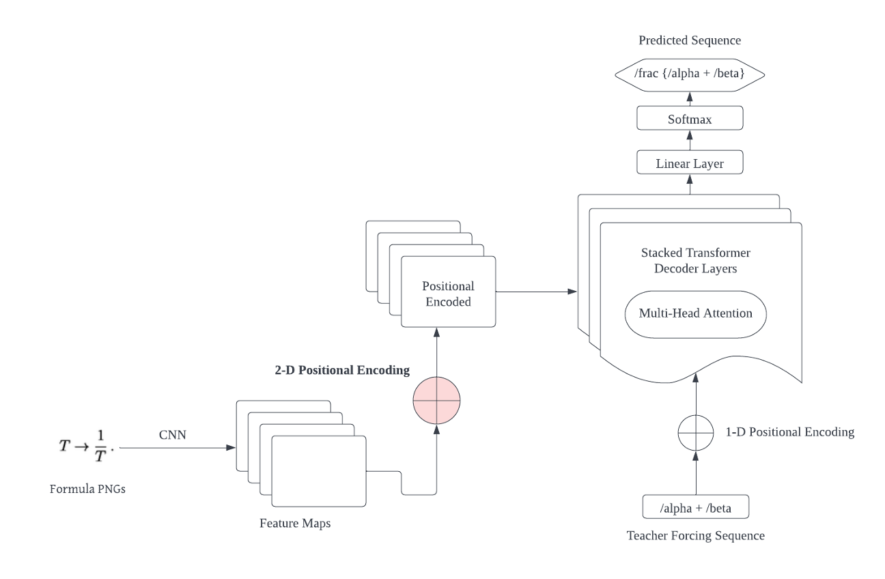

# Im2LaTeX Application

The University of Hong Kong - COMP 3362 Fall 2022 Course Project


This repository contains both the model and application (MacOS and Command Line version) with setup instructions

## Submission
| Item | Location |
| --- | --- |
| Written report | [`documents/COMP_3362_Report.pdf`](documents/COMP_3362_Report.pdf) |
| Video Presentation | [`video/video_presentation.mov`](video/video_presentation.mov) |
| Final Work | App: [`app/`](app/), Model: [`models/`](models/)

## Im2LaTeXModel



Our model adopts the encoder-decoder structure. We use modifed VGGNet as the encoder and transformer decoder. Positional encoding is added to both feature maps of the image and sequence input.

Due to computational constraint, we only trained the model for 40 epochs. And we observed that the validation perplexity contiunes to decrease at the end of our training. The model is expected to have better metrics with more training epochs. Here are the performance of our final model:

| Metrics | Validation | Test |
| --- | --- | --- |
| Perplexity | 1.12 | N/A |
| BLEU (4-gram) | N/A | 86.31 |
| Edit Distance | N/A | 88.42 |

Here are the peformance of the model on different sequence of length:

| Intervals | BLEU (4-gram) | Edit Distance |
| --- | --- | --- |
| [0, 50) | 88.68 | 94.57 |
| [50, 100) | 86.77 | 92.48 |
| [100, 150) | 78.89 | 81.63 |
| [150, 200) | 66.36 | 64.73 |
| [200, 700) | 48.94 | 40.44 |

The model is deployed through the desktop application developed

### Dataset

We use the public `Im2LaTeX-100k` as the dataset of our model. And we adopted the normalized version from [Kaggle](https://www.kaggle.com/datasets/shahrukhkhan/im2latex100k).

The dataset is splited into training, validation and test set. There are 75,275 samples in training set, 8,370 samples in validation set and 10,284 samples in test set.

The dataset in is `./dataset/im2latex-100k`, we provide a small test dataset with simple math expressions. The images are stored in `./dataset/im2latex-100k/small` and its corresponding annotation file is `./dataset/im2latex-100k/small_train.csv`. You may use these math expressions to validate the utility of your model.

### To train your own model

We provide the instructional document `Demo.ipynb`. You may follow the steps to get familar with all classes and functions that you need to train the model. After going through the whole document, you may create and train your model in a Jupyter Notebook.

It is recommended to use `Python >= 3.8.13`

Before you getting start, you may need to install the following dependencies: 

* torch
* torchvision
* pillow
* nltk
* editdistance
* pandas
* numpy
* matplotlib

You may install these dependecies using:

```
pip3 install -r models/requirement.txt
```

## Im2LaTeX Application


### App Introduction
Im2LaTeX is an application for converting formula images to LaTeX code by letting users take a screenshot of the maths formula they want to convert. 

The expected user input is a formula image containing a typed or computer-generated formula. Since there will be differences in font size, background color, etc. between user-input images and our dataset, our application applies a series of pre- processing operations on the user-input image before feeding it to the model. After that, our model will generate the LaTeX code for this formula. 

Two versions of applications with the same functionalities are implemented in our project, a CLI(command line) version and a macOS version.

### App Installation 
For installation procedure, please refer to [README.md](./app/README.md) under the `app/` folder.

## Acknowledgment 

* [tatp22/multidim-positional-encoding: An implementation of 1D, 2D, and 3D positional encoding in Pytorch and TensorFlow](https://github.com/tatp22/multidim-positional-encoding)
* [kingyiusuen/image-to-latex: Convert images of LaTex math equations into LaTex code](https://github.com/kingyiusuen/image-to-latex)
* [harvardnlp/im2markup: Neural model for converting Image-to-Markup (by Yuntian Deng yuntiandeng.com)](https://github.com/harvardnlp/im2markup)
